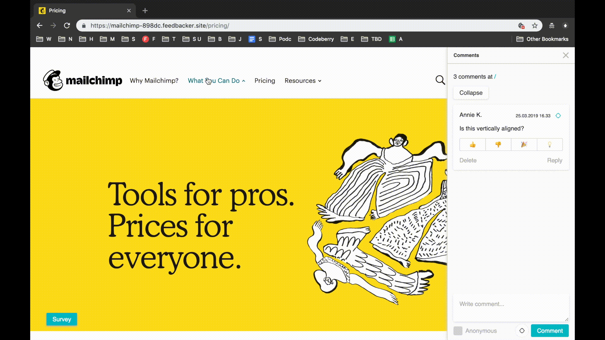

[](https://travis-ci.org/ktk-2005/Feedbacker-Forum) [](LICENSE)

Feedbacker-Forum is a modern, open-source automated deployment pipeline solution for developers to help gather feedback easily. In other words the developer can trigger a deployment process that ships a version of the current code for the product and gets a simple “feedback-able“ link in return. This link can be shared to peers that the developer craves feedback from.
The developer can then create surveys, recieve answers and discuss the live UI with peers.
Feedbacker-Forum also supports creating "feedback-able" links for existing external websites.


## Setting up

The project consist of a frontend, backend, proxy and database. The different parts can either be setup manually, or run together using containers.

### Prerequisites

The project is built using [Node.js][node], currently actively tested with version 10.13.
The project also requires [go][golang] version 1.11 for running the proxy.
Instances are run in containers with [docker][docker].

If the project is run with containers [docker-compose][docker-compose] is also required for orchestrating the containers.

The simple manual setup requires the following steps. Further run configurations can be found in [docs/getting-started.md](docs/getting-started.md).

```bash
# Install the client and build the development bundle
cd client

npm install
npm run build:dev

# Build the node-runner image
cd ../docker
docker build -t node-runner node-runner

# If you want to build the proxy
cd ../proxy
go build

# Install the API server and run it
cd ../server

npm install
npm start
```

### Alternatively setting up docker container for dev environment

```bash

cd docker/development

docker-compose up --build
```

Now you can for example open http://localhost:8080/test.html to see the API in action.

## Usage

The project consist of two different parts - the dashboard view for the developers, and the feedbacker view for giving feedback.

#### Dashboard

The dashboard view is for developers to add, remove and manage instances.
After creating an instance the developer recieves a simple link that can be shared, so that people easily can view the instance and give feedback.


---
#### Feedbacker

The feedbacker view is where the users can use, view and comment on the UI. It consists of two main parts, the survey panel and the comment panel.



---
#### Features

A brief list of supported features
* Automatically deploy your app from git, boh public repos and private Github repos supported
* Alternatively use an already live site, simply submit the url
* Easily discuss and cultivate ideas with theaded discussion, no blocking signup required
* Tag specific elements to link your comment to a specific part of the UI
* Comment anonymously on instances where you don't want to share your identity
* Specify the feedback recieved by creating surveys with normal or multiple choice questions
* Protect sensitive deployments with a passphrase
* Link Feedbacker-Forum to slack with a SlackBot


## Contributing

The project is still in a quite early development stage and is actively being developed.
Changes or additions can be proposed by creating issues or pull requests on github. Running a local development version can be setup as seen in [Setting Up](#Setting-up).

### Running tests

The project contains has style checking using [eslint][eslint] with a slightly modified [airbnb-config][airbnb-config].

```bash
# Run style checking for the frontend
cd client/
npm run lint

# Then run style checking for the backend
cd ../server/
npm run lint
```

Tests are run separately for frontend and backend. Both sets of tests can be automatically run with npm

```bash
# Run tests for frontend
cd client/
npm run test

# Then run tests for backend
cd ../server/
npm run test:api
```

The frontend test suite is done with [jest][jest] and [enzyme][enzyme]. The backend tests are currently only for the api-endpoints and are run with [mocha][mocha].

## Credits

This project was started during the course CS-C2130 Software Project at [Aalto University][aalto] for the company [Sievo][sievo].

## License

The project is licensed under the [MIT][MIT] license, see [LICENSE](LICENSE) for more details.

## Getting started // Needs to be moved/removed

For further documentation see [docs/getting-started.md](docs/getting-started.md).

[node]: https://nodejs.org/en/
[golang]: https://golang.org/
[docker]: https://www.docker.com/
[docker-compose]: https://docs.docker.com/compose/
[eslint]: https://eslint.org/
[airbnb-config]: https://github.com/airbnb/javascript
[jest]: https://jestjs.io/
[enzyme]: https://github.com/airbnb/enzyme
[mocha]: https://mochajs.org/
[aalto]: https://aalto.fi
[sievo]: https://sievo.com
[MIT]: https://opensource.org/licenses/MIT
